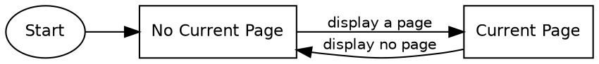

```dot
digraph B11 {
    rankdir=LR;
    node [shape=box, fontname="Helvetica", fontsize=11];
    edge [fontname="Helvetica", fontsize=10];

    Start [shape=ellipse];
    "No Current Page";
    "Current Page";

    Start -> "No Current Page";
    "No Current Page" -> "Current Page" [label="display a page"];
    "Current Page" -> "No Current Page" [label="display no page"];
}
```

```text
1. Start → No Current Page → Current Page → No Current Page
```