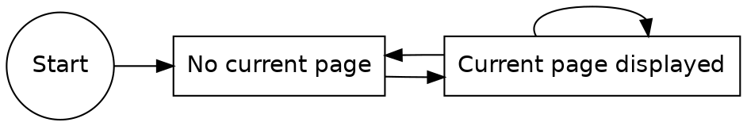

```dot
digraph B11 {
    // Requirement B11: at any moment the browser is in exactly one of two
    // mutually exclusive, jointly exhaustive states - it displays one
    // Simple HTML page (the "current" page), or it displays none at all.
    rankdir=LR;
    node [shape=box, fontname="Helvetica"];

    Start [shape=circle, label="Start"];
    NoCurrentPage [label="No current page"];
    CurrentPage [label="Current page displayed"];

    Start -> NoCurrentPage;
    NoCurrentPage -> CurrentPage;
    CurrentPage -> CurrentPage;
    CurrentPage -> NoCurrentPage;
}
```

```text
1. Start → No current page → Current page displayed → No current page
2. Start → No current page → Current page displayed → Current page displayed → No current page
```